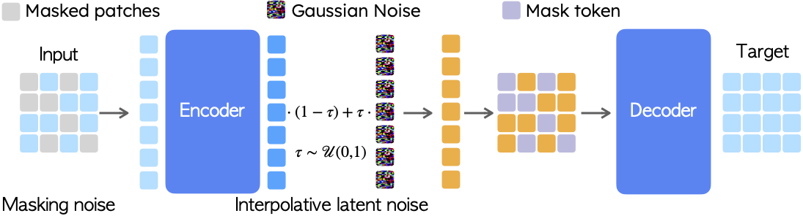

# DeTok: Latent Denoising Makes Good Visual Tokenizers <br><sub>Official PyTorch Implementation</sub>

[](https://arxiv.org/abs/2507.15856)&nbsp;
[](https://huggingface.co/jjiaweiyang/l-DeTok)&nbsp;

<p align="center">
  
</p>

This is a PyTorch/GPU implementation of the paper **Latent Denoising Makes Good Visual Tokenizers**:

```
@article{yang2025detok,
  title={Latent Denoising Makes Good Visual Tokenizers},
  author={Jiawei Yang and Tianhong Li and Lijie Fan and Yonglong Tian and Yue Wang},
  journal={arXiv preprint arXiv:2507.15856},
  year={2025}
}
```

This repo contains:

* 🪐 A simple PyTorch implementation of [l-DeTok](models/detok.py) tokenizer and various generative models ([MAR](models/mar.py), [RandARDiff](models/ardiff.py), [RasterARDiff](models/ardiff.py), [DiT](models/dit.py), [SiT](models/sit.py), and [LightningDiT](models/lightningdit.py))
* ⚡️ Pre-trained DeTok tokenizers and MAR models trained on ImageNet 256x256
* 🛸 Training and evaluation scripts for tokenizer and generative models
* 🎉 Hugging Face for easy access to pre-trained models

## Preparation


### Installation

Download the code:
```bash
git clone https://github.com/Jiawei-Yang/detok.git
cd detok
```

Create and activate conda environment:
```bash
conda create -n detok python=3.10 -y && conda activate detok
pip install -r requirements.txt
```

### Dataset
Create `data/` folder by `mkdir data/` then download [ImageNet](http://image-net.org/download) dataset. You can either:
1. Download it directly to `data/imagenet/` 
2. Create a symbolic link: `ln -s /path/to/your/imagenet data/imagenet`


### Download Required Files

Create data directory and download required files:
```bash
mkdir data/
# Download everything from huggingface
huggingface-cli download jjiaweiyang/l-DeTok --local-dir released_model
mv released_model/train.txt data/
mv released_model/val.txt data/
mv released_model/fid_stats data/
mv released_model/imagenet-val-prc.zip ./data/

# Unzip: imagenet-val-prc.zip for precision & recall evaluation
python -m zipfile -e ./data/imagenet-val-prc.zip ./data/
```

### Data Organization

Your data directory should be organized as follows:
```
data/
├── fid_stats/          # FID statistics
│   ├── adm_in256_stats.npz
│   └── val_fid_statistics_file.npz
├── imagenet/           # ImageNet dataset (or symlink)
│   ├── train/
│   └── val/
├── imagenet-val-prc/   # Precision-recall data
├── train.txt           # Training file list
└── val.txt             # Validation file list
```

## Models

For convenience, our pre-trained models will be available on Hugging Face:

| Model               | Type      | Params | Hugging Face |
|---------------------|-----------|-------|-------------|
| DeTok-BB            | Tokenizer | 172M  | [🤗 detok-bb](https://huggingface.co/jjiaweiyang/l-DeTok/resolve/main/detok-BB-gamm3.0-m0.7.pth) |
| DeTok-BB-decoder_ft | Tokenizer | 172M  | [🤗 detok-bb-decoder_ft](https://huggingface.co/jjiaweiyang/l-DeTok/resolve/main/detok-BB-gamm3.0-m0.7-decoder_tuned.pth) |
| MAR-Base            | Generator | 208M  | [🤗 mar-base](https://huggingface.co/jjiaweiyang/l-DeTok/resolve/main/mar_base.pth) |
| MAR-Large           | Generator | 479M  | [🤗 mar-large](https://huggingface.co/jjiaweiyang/l-DeTok/resolve/main/mar_large.pth) |

FID-50k with CFG:
|cfg| MAR Model                         | FID-50K | Inception Score |
|---|-----------------------------------|---------|-----------------|
|3.9| MAR-Base + DeTok-BB               | 1.61    | 289.7           |
|3.9| MAR-Base + DeTok-BB-decoder_ft    | 1.55    | 291.0           |
|3.4| MAR-Large + DeTok-BB              | 1.43    | 303.5           |
|3.4| MAR-Large + DeTok-BB-decoder_ft   | 1.32    | 304.1           |

## Usage

### Demo
Run our demo using notebook at [demo.ipynb](demo.ipynb)


## Training

### 1. Tokenizer Training

Train DeTok tokenizer with denoising:
```bash
project=tokenizer_training
exp_name=detokBB-g3.0-m0.7-200ep
batch_size=32  # global batch size = batch_size x num_nodes x 8 = 1024
num_nodes=4    # adjust for your multi-node setup
YOUR_WANDB_ENTITY=""  # change to your wandb entity

torchrun --nproc_per_node=8 --nnodes=$num_nodes --node_rank=${NODE_RANK} --master_addr=${MASTER_ADDR} --master_port=${MASTER_PORT} \
    main_reconstruction.py \
    --project $project --exp_name $exp_name --auto_resume \
    --batch_size $batch_size --model detok_BB \
    --gamma 3.0 --mask_ratio 0.7 \
    --online_eval \
    --epochs 200 --discriminator_start_epoch 100 \
    --data_path ./data/imagenet/train \
    --entity $YOUR_WANDB_ENTITY --enable_wandb
```

Decoder fine-tuning:
```bash
project=tokenizer_training
exp_name=detokBB-g3.0-m0.7-200ep-decoder_ft-100ep
batch_size=32
num_nodes=4
pretrained_tok=work_dirs/tokenizer_training/detokBB-g3.0-m0.7-200ep/checkpoints/latest.pth
YOUR_WANDB_ENTITY=""

torchrun --nproc_per_node=8 --nnodes=$num_nodes --node_rank=${NODE_RANK} --master_addr=${MASTER_ADDR} --master_port=${MASTER_PORT} \
    main_reconstruction.py \
    --project $project --exp_name $exp_name --auto_resume \
    --batch_size $batch_size --model detok_BB \
    --load_from $pretrained_tok \
    --online_eval --train_decoder_only \
    --perceptual_weight 0.1 \
    --gamma 0.0 --mask_ratio 0.0 \
    --blr 5e-5 --warmup_rate 0.05 \
    --epochs 100 --discriminator_start_epoch 0 \
    --data_path ./data/imagenet/train \
    --entity $YOUR_WANDB_ENTITY --enable_wandb
```

### 2. Generative Model Training

Train MAR-base (100 epochs):
```bash
tokenizer_project=tokenizer_training
tokenizer_exp_name=detokBB-g3.0-m0.7-200ep-decoder_ft-100ep
project=gen_model_training
exp_name=mar_base-${tokenizer_exp_name}
batch_size=32  # global batch size = batch_size x num_nodes x 8 = 1024 
num_nodes=4
epochs=100

torchrun --nproc_per_node=8 --nnodes=$num_nodes --node_rank=${NODE_RANK} --master_addr=${MASTER_ADDR} --master_port=${MASTER_PORT} \
    main_diffusion.py \
    --project $project --exp_name $exp_name --auto_resume \
    --batch_size $batch_size --epochs $epochs --use_aligned_schedule \
    --tokenizer detok_BB --use_ema_tokenizer --collect_tokenizer_stats \
    --stats_key $tokenizer_exp_name --stats_cache_path work_dirs/stats.pkl \
    --load_tokenizer_from work_dirs/$tokenizer_project/$tokenizer_exp_name/checkpoints/latest.pth \
    --model MAR_base --no_dropout_in_mlp \
    --diffloss_d 6 --diffloss_w 1024 \
    --num_sampling_steps 100 --cfg 4.0 \
    --cfg_list 3.0 3.5 3.7 3.8 3.9 4.0 4.1 4.3 4.5 \
    --vis_freq 50 --eval_bsz 256 \
    --data_path ./data/imagenet/train \
    --entity $YOUR_WANDB_ENTITY --enable_wandb
```

Train SiT-base (100 epochs):
```bash
tokenizer_project=tokenizer_training
tokenizer_exp_name=detokBB-g3.0-m0.7-200ep-decoder_ft-100ep
project=gen_model_training
exp_name=sit_base-${tokenizer_exp_name}
batch_size=32
num_nodes=4
epochs=100

torchrun --nproc_per_node=8 --nnodes=$num_nodes --node_rank=${NODE_RANK} --master_addr=${MASTER_ADDR} --master_port=${MASTER_PORT} \
    main_diffusion.py \
    --project $project --exp_name $exp_name --auto_resume \
    --batch_size $batch_size --epochs $epochs --use_aligned_schedule \
    --tokenizer detok_BB --use_ema_tokenizer --collect_tokenizer_stats \
    --stats_key $tokenizer_exp_name --stats_cache_path work_dirs/stats.pkl \
    --load_tokenizer_from work_dirs/$tokenizer_project/$tokenizer_exp_name/checkpoints/latest.pth \
    --model SiT_base \
    --num_sampling_steps 250 --cfg 1.6 \
    --cfg_list 1.3 1.4 1.5 1.6 1.7 1.8 1.9 2.0 \
    --vis_freq 50 --eval_bsz 256 \
    --data_path ./data/imagenet/train \
    --entity $YOUR_WANDB_ENTITY --enable_wandb
```

### 3. Training with the released DeTok

Train MAR-base for 800 epochs using released tokenizer:
```bash
project=gen_model_training
exp_name=mar_base_800ep-detok-BB-gamm3.0-m0.7-decoder_tuned
batch_size=16  # global batch size = batch_size x num_nodes x 8 = 1024 
num_nodes=8
epochs=800

torchrun --nproc_per_node=8 --nnodes=$num_nodes --node_rank=${NODE_RANK} --master_addr=${MASTER_ADDR} --master_port=${MASTER_PORT} \
    main_diffusion.py \
    --project $project --exp_name $exp_name --auto_resume \
    --batch_size $batch_size --epochs $epochs --use_aligned_schedule \
    --tokenizer detok_BB --use_ema_tokenizer --collect_tokenizer_stats \
    --stats_key detok-BB-gamm3.0-m0.7 --stats_cache_path released_model/stats.pkl \
    --load_tokenizer_from released_model/detok-BB-gamm3.0-m0.7-decoder_tuned.pth \
    --model MAR_base --no_dropout_in_mlp \
    --diffloss_d 6 --diffloss_w 1024 \
    --num_sampling_steps 100 --cfg 3.9 \
    --cfg_list 3.0 3.5 3.7 3.8 3.9 4.0 4.1 4.3 4.5 \
    --online_eval --vis_freq 80 --eval_bsz 256 \
    --data_path ./data/imagenet/train \
    --entity $YOUR_WANDB_ENTITY --enable_wandb
```

Train MAR-large for 800 epochs:
```bash
project=gen_model_training
exp_name=mar_large_800ep-detok-BB-gamm3.0-m0.7-decoder_tuned
batch_size=16
num_nodes=8
epochs=800

torchrun --nproc_per_node=8 --nnodes=$num_nodes --node_rank=${NODE_RANK} --master_addr=${MASTER_ADDR} --master_port=${MASTER_PORT} \
    main_diffusion.py \
    --project $project --exp_name $exp_name --auto_resume \
    --batch_size $batch_size --epochs $epochs --use_aligned_schedule \
    --tokenizer detok_BB --use_ema_tokenizer --collect_tokenizer_stats \
    --stats_key detok-BB-gamm3.0-m0.7 --stats_cache_path released_model/stats.pkl \
    --load_tokenizer_from released_model/detok-BB-gamm3.0-m0.7-decoder_tuned.pth \
    --model MAR_large --no_dropout_in_mlp \
    --diffloss_d 8 --diffloss_w 1280 \
    --num_sampling_steps 100 --cfg 3.4 \
    --cfg_list 3.0 3.2 3.3 3.4 3.5 3.6 3.7 3.8 3.9 \
    --online_eval --vis_freq 80 --eval_bsz 256 \
    --data_path ./data/imagenet/train \
    --entity $YOUR_WANDB_ENTITY --enable_wandb
```

## Evaluation (ImageNet 256x256)

### Evaluate pretrained MAR-Base
```bash
torchrun --nproc_per_node=8 --nnodes=1 --node_rank=0 \
    main_diffusion.py \
    --project mar_eval --exp_name mar_base_ep800 --auto_resume \
    --batch_size 64 --epochs 800 --use_aligned_schedule \
    --tokenizer detok_BB --use_ema_tokenizer --collect_tokenizer_stats \
    --stats_key detok-BB-gamm3.0-m0.7 --stats_cache_path released_model/stats.pkl \
    --load_tokenizer_from released_model/detok-BB-gamm3.0-m0.7-decoder_tuned.pth \
    --model MAR_base --no_dropout_in_mlp \
    --diffloss_d 6 --diffloss_w 1024 \
    --load_from released_model/mar_base.pth \
    --num_sampling_steps 100 --eval_bsz 256 --num_images 50000 --num_iter 256 --evaluate \
    --cfg 3.9 \
    --data_path ./data/imagenet/train
```

### Evaluate pretrained MAR-Large
```bash
torchrun --nproc_per_node=8 --nnodes=1 --node_rank=0 \
    main_diffusion.py \
    --project mar_eval --exp_name mar_large_ep800 --auto_resume \
    --batch_size 64 --epochs 800 --use_aligned_schedule \
    --tokenizer detok_BB --use_ema_tokenizer --collect_tokenizer_stats \
    --stats_key detok-BB-gamm3.0-m0.7 --stats_cache_path released_model/stats.pkl \
    --load_tokenizer_from released_model/detok-BB-gamm3.0-m0.7-decoder_tuned.pth \
    --model MAR_large --no_dropout_in_mlp \
    --diffloss_d 8 --diffloss_w 1280 \
    --load_from released_model/mar_large.pth \
    --num_sampling_steps 100 --eval_bsz 256 --num_images 50000 --num_iter 256 --evaluate \
    --cfg 3.4 \
    --data_path ./data/imagenet/train
```

FID-50k with CFG:
|cfg| MAR Model                    | FID-50K | Inception Score | #params | 
|---|------------------------------|---------|-----------------|---------|
|3.9| MAR-B + l-DeTok              | 1.61    | 289.7           | 208M    |
|3.9| MAR-B + l-DeTok (decoder_ft) | 1.55    | 291.0           | 208M    |
|3.4| MAR-L + l-DeTok              | 1.43    | 303.5           | 479M    |
|3.4| MAR-L + l-DeTok (decoder_ft) | 1.32    | 304.1           | 479M    |


**Note:** 
- Set `--cfg 1.0 --temperature 0.95` to evaluate without CFG for MAR-base and `--cfg 1.0 --temperature 0.97` for MAR-large
- Generation speed can be significantly increased by reducing the number of autoregressive iterations (e.g., `--num_iter 64`)

## Acknowledgements
We thank the authors of [MAE](https://github.com/facebookresearch/mae), [MAGE](https://github.com/LTH14/mage), [DiT](https://github.com/facebookresearch/DiT), [LightningDiT](https://github.com/hustvl/LightningDiT), [MAETok](https://github.com/Hhhhhhao/continuous_tokenizer) and [MAR](https://github.com/LTH14/mar) for their foundational work.

Our codebase builds upon several excellent open-source projects, including [MAR](https://github.com/LTH14/mar) and [1d-tokenizer](https://github.com/bytedance/1d-tokenizer). We are grateful to the communities behind them.

## Contact
This codebase has been cleaned up but has not undergone extensive testing. If you encounter any issues or have questions, please open a GitHub issue. We appreciate your feedback!